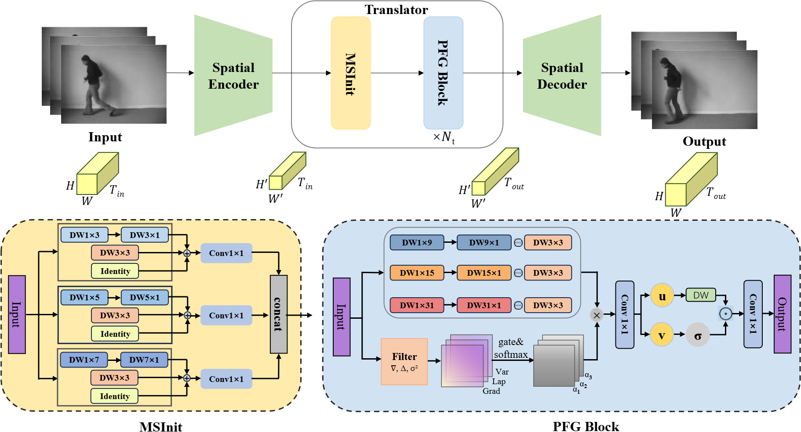

# PFGNet: A Fully Convolutional Frequency-Guided Peripheral Gating Network for Efficient Spatiotemporal Predictive Learning


Our work was accepted by CVPR 2026! 🎉✨

---

## Overview

<p align="center">
  
</p>

PFGNet is a fully convolutional framework that dynamically modulates receptive fields via pixel-wise frequency-guided gating. Inspired by biological center-surround mechanisms, our Peripheral Frequency Gating (PFG) block extracts local spectral cues (gradient, Laplacian, variance) to fuse multi-scale large-kernel peripheral responses with learnable center suppression. This forms adaptive ring-shaped band-pass filters that selectively amplify mid-frequency motion while suppressing static backgrounds and noise. By decomposing large kernels into separable 1D convolutions ($1 \times k$ and $k \times 1$), we reduce per-channel complexity from $\mathcal{O}(k^2)$ to $\mathcal{O}(2k)$. Without relying on recurrence or attention, PFGNet delivers SOTA or near-SOTA spatiotemporal forecasting accuracy with minimal computational overhead.

---

## 1. Environment setup

This repository directly inherits the codebase and dependencies of OpenSTL. We recommend first making sure you can successfully run OpenSTL.

```bash
conda env create -f environment.yml
conda activate PFG
pip install -r requirements.txt
python setup.py develop
```

---

## 2. Data preparation

Data preparation scripts are provided under:

```
tools/prepare_data/
```

Please ensure that processed datasets are placed under:

```
yourprojectname/data/
```

(for example, `yourprojectname/data/mmnist/` for Moving MNIST).

---

## 3. Core code

```
├── data/moving_mnist
├── configs/
│   └── mmnist/PFG.py      # Moving MNIST config
├── openstl/
│   ├── modules/
│   │   ├── pfg_modules.py                       
│   │   └── layers/pfg.py              
│   └── models/
│       └── pfg_model.py    
├── tools/
│   ├── train.py                       
│   └── test.py                        
└── README.md
```

---

## 4. Usage (Moving MNIST example)

### 4.1 Configuration

We provide an independent configuration for the PFG version of SimVP, for example:

```
configs/mmnist/PFG.py
```

---

### 4.2 Training

From the repository root, run:

```bash
python tools/train.py -d mmnist -c configs/mmnist/PFG.py --ex_name mmnist_pfg --test
```

If multi-GPU training is needed, you can write your own launcher script as in OpenSTL, still using `tools/train.py` as the entry point.

---

### 4.2 Testing

From the repository root, run:

```bash
python tools/test.py -d mmnist -c configs/mmnist/PFG.py --ex_name mmnist_pfg --test
```

---

This project is built on top of the OpenSTL framework in terms of code structure, training pipeline, and data preparation.  
We sincerely thank the authors and contributors of OpenSTL for their great work.
